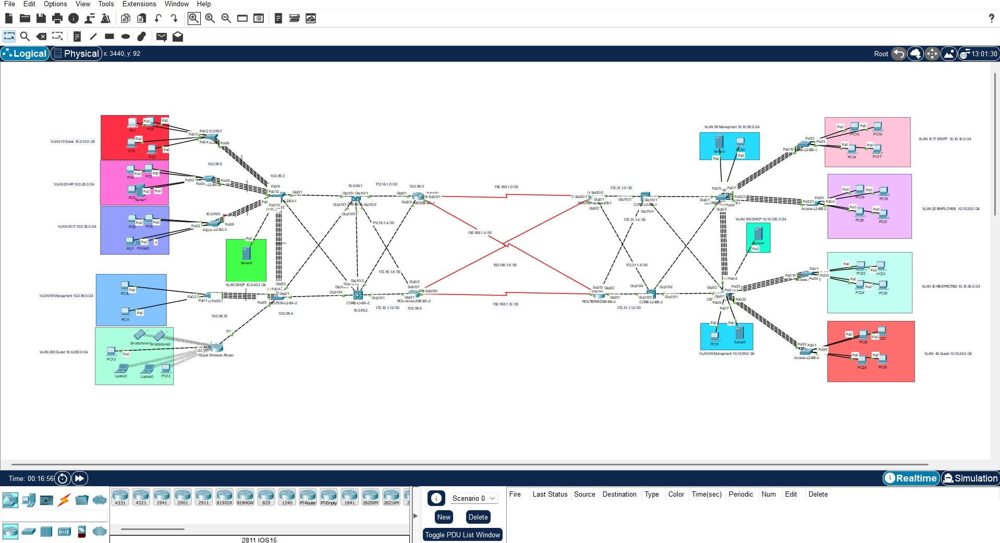
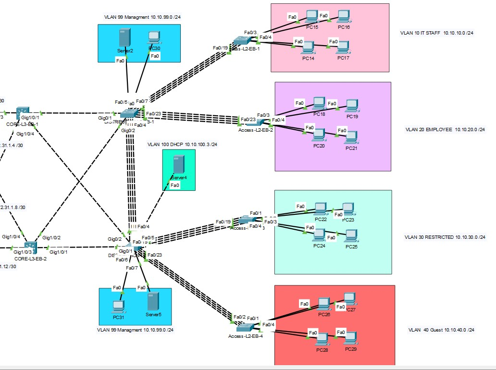
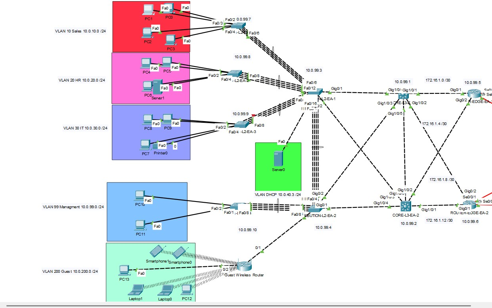
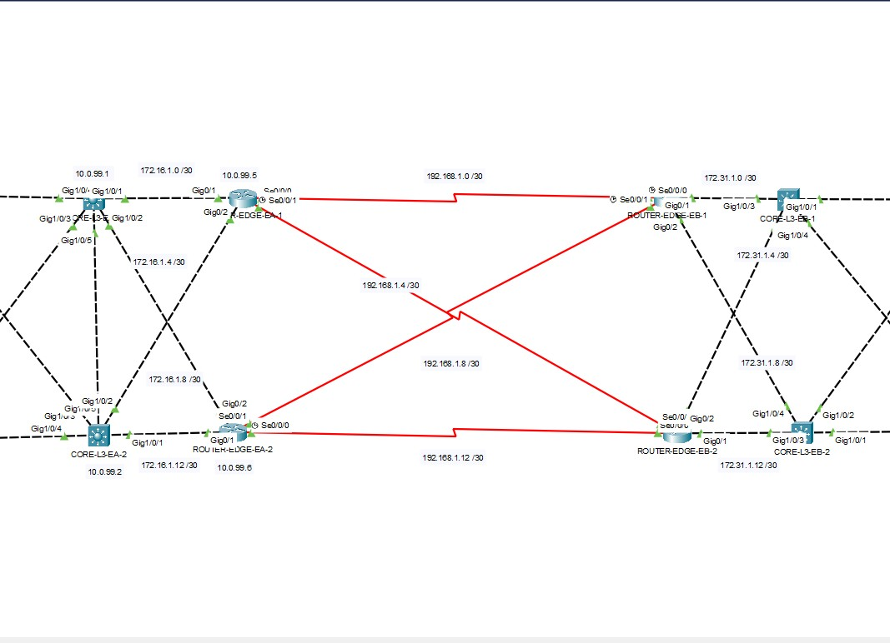
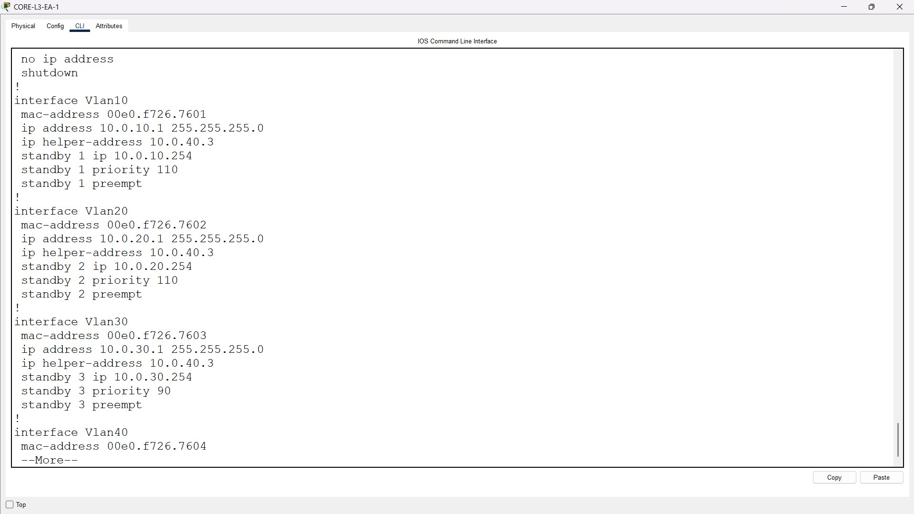
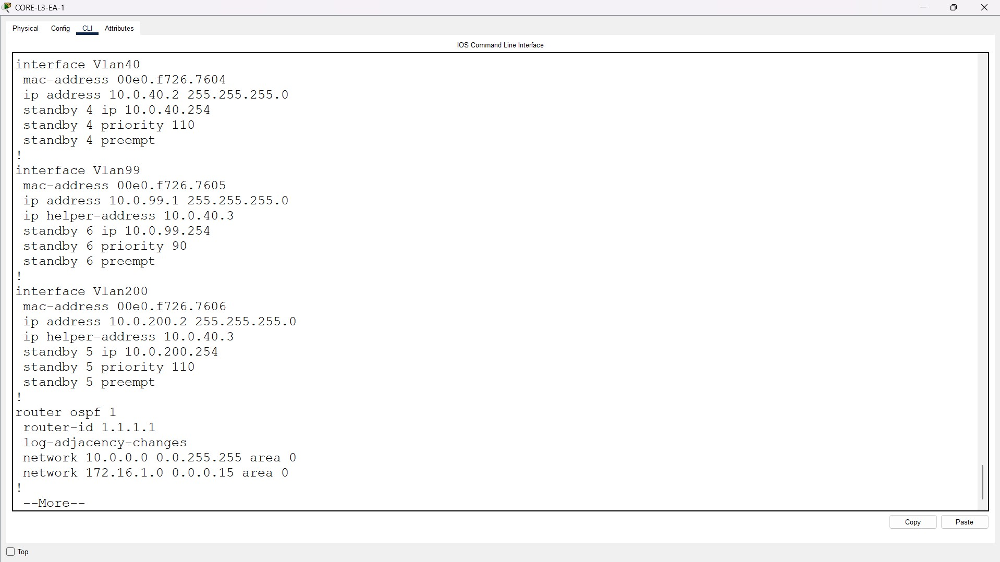
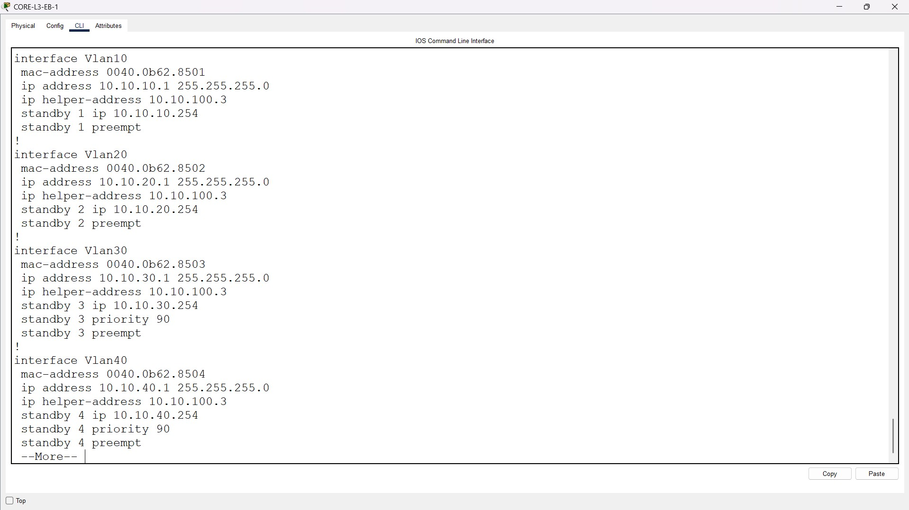
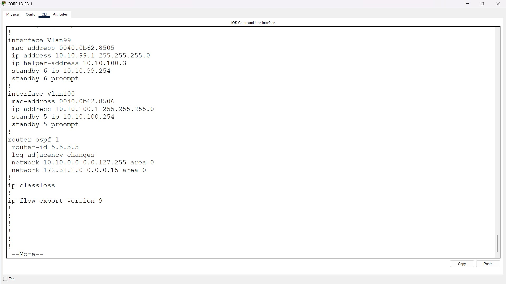
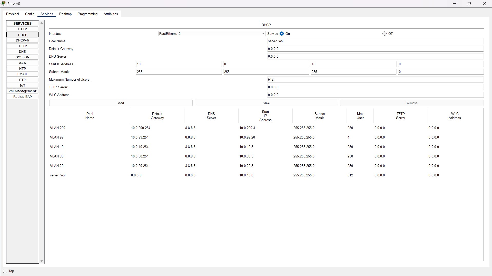

# 🖧 Dual-Enterprise Network Infrastructure  
## Advanced Cisco Configuration Project

This project showcases the design, configuration, and deployment of a **dual-enterprise network** using advanced Cisco routing, switching, and security mechanisms. The goal is to simulate a realistic multi-site enterprise topology with **redundancy, scalability, and security** at every layer.

---

## 🖼️ Network Topology – Full Views

### 🔹 Global Topology Overview

### 🔹 Enterprise A – Topology

### 🔹 Enterprise B – Topology

### 🔹 Mid Network / Interconnection Area

---

## 🧩 Core Switch & Routing Configuration Views

### 🔹 Enterprise A Core Switches
  

### 🔹 Enterprise B Core Switches
  

---

## 🖥️ DHCP Server Configuration

### 🔹 Enterprise A DHCP

### 🔹 Enterprise B DHCP

---

## 🚀 Project Overview

This lab implements a full **Core–Distribution–Access architecture** across two interconnected enterprises.  
Each enterprise uses VLAN segmentation, HSRP gateway redundancy, OSPF multi-area routing, DHCP services, and Layer 2 security.

The interconnection between both enterprises uses **secure OSPF authentication** and controlled routing.

---

## 🔧 Technologies Implemented

### **Layer 2 Switching**
- VLAN segmentation (Sales, HR, IT, Management, Guest)  
- VTP for centralized VLAN propagation  
- DTP for dynamic trunk negotiation  
- PVST+ (Per-VLAN Spanning Tree)  
- EtherChannel (LACP/PAgP)  
- Port Security on access ports  
- STP security (BPDU Guard, PortFast, Root Guard)  

### **Routing & Redundancy**
- Inter-VLAN routing (SVIs)  
- OSPF Multi-Area  
- Static routes for backup paths  
- HSRP gateway redundancy  
- OSPF MD5 authentication  

### **Network Services**
- Centralized DHCP pools  
- DHCP Snooping  
- SSH for secure device management  
- AAA for access control  

---

## ▶️ How to Use This Project

1.  [Download the Packet Tracer file](./Dual-Enterprise-Network-Infrastructure-Advanced-Cisco-Configuration-Project.pkt) file from this repository  
2. Open it in **Cisco Packet Tracer**  
3. Verify the following:  
   - OSPF area adjacency  
   - HSRP failover  
   - DHCP IP allocation  
   - Port Security behavior  
   - SSH & AAA authentication  
4. Explore configuration logic using the included screenshots  

---

## 🔮 Future Enhancements

- Add BGP between enterprises  
- Introduce IPSec VPN  
- Implement Syslog, SNMP, and NetFlow monitoring  
- Add IPv6 across both enterprises  

---

## 👨‍💻 Author

**Adib**  
**IT Specialist – Systems & Networks**  
Passionate about enterprise network design, Cisco technologies, and infrastructure engineering.
